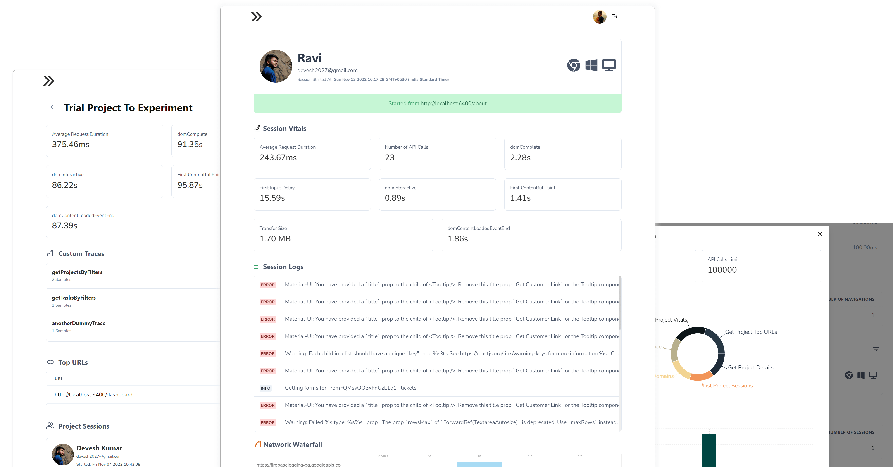

# Spot - The Frontend Monitoring Stack

  

Check [the app](https://spot-monitoring.vercel.app)

Read [the documentation](https://spot-monitoring.vercel.app/docs)

[Reach Out](https://www.linkedin.com/in/dev-esh/)

[Raise an Issue](https://github.com/deve-sh/Spot/issues/new)
